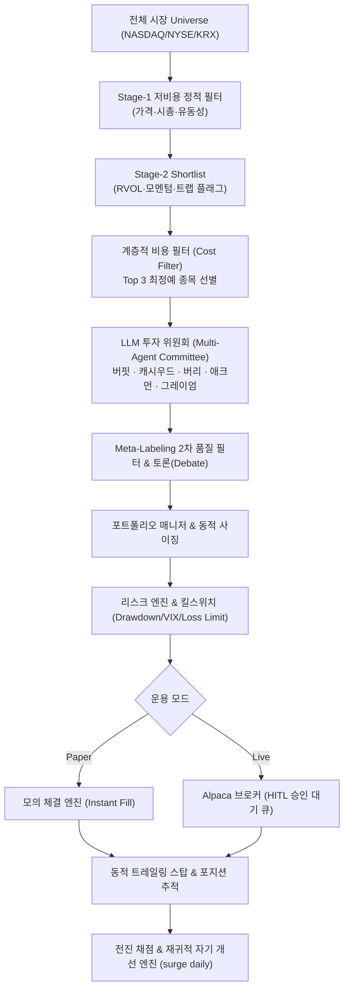

# surge_HTS — 자율형 멀티에이전트 퀀트 트레이딩 & 급등주 예측 아키텍처

> **"계좌가 살아남는 자율 퀀트 인프라"**  
> 전일 종가 대비 **+100% 급등 후보 포착** 및 **SOXL/SOXS 레버리지 듀얼 매매**를 수행하는 프로덕션급 퀀트 시스템입니다.  
> 단순 예측 모델에 의존하지 않고, **사후 복원 불가능한 시점별 피처(Point-in-Time Snapshot)를 매일 아카이빙**하며, **LLM 투자 위원회와 기관급 리스크 관리 엔진**을 통해 운용됩니다.

---

## 1. 핵심 아키텍처 개요



### A. 2단계 깔때기 & 생존자 편향 차단
- **기저율 0.1% 후보를 2~5%까지 압축**: 전체 유니버스에서 저가·소형·유동성 정적 필터로 후보를 압축한 뒤, 비싼 구조/옵션/SEC 공시 API는 최종 쇼트리스트에만 적용합니다.
- **Point-in-Time 아카이빙**: 상장폐지(Delisted) 종목을 절대 삭제하지 않고 보존하여 백테스트 왜곡 및 생존자 편향을 100% 원천 차단합니다.

### B. 진정한 LLM-Driven 투자 위원회 (Multi-Agent Committee)
- **전설적 투자자 5인 페르소나**:
  - **Warren Buffett**: 경제적 해자(Moat), 안정적 마진, 유상증자/독성부채 거부
  - **Cathie Wood**: 지수적 성장성, 폭발적 상대 거래량(RVOL), 유통주식수(Float) 탄력성
  - **Michael Burry**: 포렌식 리스크 검증, S-1/S-3 희석 폭탄, 펌프앤덤프 감지 및 **강력 거부권(Veto)**
  - **Bill Ackman**: 계약, FDA 승인, 실적 서프라이즈 등 핵심 행동주의 촉매(Catalyst) 추적
  - **Benjamin Graham**: 순유동자산 대비 청산가치 안전마진(Margin of Safety) 평가
- **컨텍스트 RAG 주입**: yfinance 실시간 뉴스 헤드라인과 SEC EDGAR 공시(8-K, 10-Q) 전문을 LLM에 주입하여 심층 추론(Reasoning)을 도출합니다.
- **계층적 비용 필터(Hierarchical Cost Filter)**: 매일 수십 개 후보 전체를 LLM으로 돌려 발생하는 API 비용 폭탄을 방지하기 위해, 기술적 스코어 상위 **Top 3 최정예 종목에 대해서만 LLM 위원회를 소집**합니다. (API 키 부재 시 규칙 기반 로직으로 Graceful Fallback)

### C. 기관급 체결 및 리스크 관리 엔진
- **Alpaca Live Broker 실거래 완전 통합**: Paper(모의) 거래는 즉시 체결되며, Live(실거래)는 **Human-In-The-Loop(HITL)** 원칙에 따라 웹 대시보드에서 사람이 명시적으로 승인(Approve)해야만 브로커로 실제 주문이 전송됩니다.
- **동적 트레일링 스탑 (Dynamic Trailing Stop)**: 수익 구간 진입 시 고점 대비 설정 비율 하락 지점으로 손절선(Stop Price)을 능동적으로 상향 갱신(Ratchet)하여 이익을 확정 짓습니다.
- **메타 라벨링 (Meta-Labeling) 2차 필터**: Marcos López de Prado의 금융 머신러닝 기법을 적용하여 1차 신호의 베팅 신뢰도를 재검증하고 승률을 극대화합니다.
- **기관급 퀀트 티어 시트 (Quant Tear Sheet)**: 연율화 수익률, Sharpe, Sortino, Calmar, CVaR 95%(Expected Shortfall), Omega Ratio, Max Drawdown을 실시간 산출합니다.
- **시세 3중 Failover**: yfinance → Finnhub API → Yahoo 직접 스크랩의 3단계 폴백 구조로 단일 장애점(SPOF)을 제거했습니다.

### D. 재귀적 자기 개선 엔진 (Recursive Self-Improvement)
- `surge daily` 루프를 통해 전일 예측 결과를 자동으로 채점(Scoring)합니다.
- Šidák 다중검정 보정이 적용된 가설 발굴기(`learn.py`)가 오류 원인(Culprit)과 신호 충돌을 분석하여 새로운 섀도 팩터와 가중치 변형을 전진 경쟁에 자동 투입합니다.
- **Anytime-valid e-값 (e≥20)** 검정으로 엿보기 편향(Optional-stopping bias) 없는 무결점 통계적 검증을 제공합니다.

---

## 2. 설치 및 시작하기

### 필수 요구사항
- Python 3.12+
- [uv](https://github.com/astral-sh/uv) (초고속 파이썬 패키지 관리자)

### 1) 저장소 클론 및 패키지 동기화
```bash
git clone https://github.com/489156/surge_HTS.git
cd surge_HTS

# uv를 통한 가상환경 구축 및 의존성 초고속 설치
uv sync --extra llm --extra kr
```

### 2) 환경 변수 설정 (`.env`)
프로젝트 루트에 `.env` 파일을 생성하거나 수정합니다:
```ini
# 시스템 기본 설정
ENVIRONMENT=production
TRADING_MODE=paper                  # paper 또는 live
STARTING_CAPITAL=10000.0

# LLM 투자 위원회 (선택 - 없으면 규칙 기반 fallback)
ANTHROPIC_API_KEY=your_claude_api_key
ANTHROPIC_MODEL=claude-3-5-haiku-20241022

# 실거래 브로커 (Alpaca)
ALPACA_API_KEY=your_alpaca_key
ALPACA_SECRET_KEY=your_alpaca_secret
ALPACA_BASE_URL=https://paper-api.alpaca.markets

# 시세 3중화 (선택 - yfinance 및 Yahoo 스크랩은 무료 기본 동작)
FINNHUB_API_KEY=your_finnhub_key

# 리스크 관리
ENABLE_TRAILING_STOPS=true
TRAILING_STOP_PCT=0.10             # 10% 트레일링 스탑
MAX_DAILY_LOSS_PCT=0.03            # 일간 3% 손실 시 당일 신규 진입 차단
MAX_DRAWDOWN_PCT=0.10              # 누적 10% 드로다운 시 강제 청산(Kill-Switch)
```

### 3) 초기 데이터베이스 및 유니버스 적재
```bash
uv run surge init                   # SQLite WAL 모드 DB 초기화
uv run surge universe               # NASDAQ Trader 무료 종목 마스터 적재
```

---

## 3. 핵심 사용법 (CLI 매뉴얼)

### A. 일일 스냅샷 및 워치리스트
```bash
# 당일 시장 데이터 및 구조적 피처 스냅샷 아카이빙
uv run surge snapshot --fast

# 오늘의 급등 점화 후보 랭킹 및 자연어 근거 확인
uv run surge watchlist --why

# 급등 후 익일 되돌림(페이드) 후보 워치리스트
uv run surge reversals --why

# 과거 후보들의 실제 익일 성과 백필 및 적중률 평가
uv run surge backfill-outcomes
uv run surge eval --k 10
```

### B. 멀티에이전트 HTS 자동매매 및 대시보드
```bash
# 트레이딩 1사이클 수동 실행 (의사결정 -> 토론 -> 리스크 검증 -> 주문)
uv run surge trade --top 8

# 포트폴리오 및 퀀트 티어 시트 지표 조회
uv run surge portfolio

# 실거래(Live) 승인 대기 큐 확인 (수동 승인/거부)
uv run surge approvals

# 긴급 전량 청산 및 시스템 중단 (Kill-Switch)
uv run surge killswitch --reason "Manual intervention"

# HTS 웹 대시보드 가동 (브라우저 접속: http://127.0.0.1:8000)
uv run surge dashboard
```

### C. 야간 SOXL vs SOXS 듀얼 (`surge duel`)
```bash
# 오늘 밤 SOXL vs SOXS 판정 및 주문 신호 생성 (아시아 반도체 + NQ선물 기반)
uv run surge duel

# 듀얼 모델 성과 사후 채점 및 갭 분석
uv run surge duel-eval
uv run surge duel-gap

# 시세 공급자 3중화 상태 점검
uv run surge quotes --health
```

### D. 자율 학습 및 검증 게이트
```bash
# 전략별 anytime-valid e-값 및 기준선 초과 검증 (가장 먼저 확인)
uv run surge verdict

# 매일의 자기개선 폐쇄 루프 1회 가동 (채점 -> 진화 -> 판정 -> 기록)
uv run surge daily

# 신규 발굴된 가설 팩터 리더보드
uv run surge factors
```

---

## 4. 자동화 파이프라인 (무인 운영 체계)

본 시스템은 PC 전원 상태 및 클라우드 환경에 맞춰 **이중화된 무인 자동화 계층**을 지원합니다.

### 1) GitHub Actions 클라우드 파이프라인 (권장)
- `.github/workflows/daily-pipeline.yml`: 평일 개장 전(미국 UTC 13:30) 콜 생성 및 마감 후(UTC 00:00) 채점·자기개선을 완전 무인으로 실행하고 결과를 리포지토리에 자동 커밋합니다.
- `.github/workflows/ci.yml`: 모든 PR 및 커밋에 대해 오프라인 모킹 테스트(377개 테스트) 및 Ruff Lint 무결성을 자동 검증합니다.

### 2) Windows 작업 스케줄러 로컬 파이프라인
로컬 PC를 상시 가동하는 트레이더를 위한 OS 레벨 자동화 스크립트입니다:
```powershell
# 스케줄러 등록 (관리자 권한 PowerShell)
powershell -ExecutionPolicy Bypass -File scripts\setup_scheduled_tasks.ps1

# 등록 상태 확인
Get-ScheduledTask -TaskName 'surge-*' | Select-Object TaskName,State
```
*등록되는 루틴:*
- `surge-daily-evening` (매일 21:35 KST): 미국 6개 페어 야간 콜 생성
- `surge-daily-morning` (매일 07:13 KST): 전일자 채점, 갭 분석, 데일리 리포트
- `surge-kr-eod` (매일 16:05 KST): 한국장 마감 후 회전(Rotation) 후보 산출
- `surge-self-improve` (매일 07:55 KST): 자기 개선 루프 (`surge daily`)

---

## 5. HTS 웹 대시보드 화면 구성

`uv run surge dashboard` 실행 후 `http://127.0.0.1:8000` 접속 시 단일 화면에서 모든 상태를 관제할 수 있습니다:

1. **상단 검증 게이트 (Blue Bar)**: 전략별 실측 엣지 판정 (⭐신호 / 🟢엣지 / 🟡미검증 / ⛔음의 엣지)
2. **오늘밤 Duel 콜 & 회전 후보**: 미국 SOXL/SOXS 및 한국 가치사슬 추천 후보
3. **포트폴리오 & 기관급 티어 시트**: 총 자산, 당일 손익, Sharpe, Sortino, Calmar, CVaR 95%, Max Drawdown
4. **실시간 승인 대기 큐 (Live Approval Queue)**: 라이브 주문의 Human-In-The-Loop 안전 승인 버튼 (✓ 클릭 시 Alpaca 실제 전송)
5. **리스크 한도 및 감사 로그 (Audit)**: 모든 결정과 킬스위치 상태의 실시간 추적 기록

---

## 6. 안전 수칙 및 법적 고지

- **정보 및 도구 제공 목적**: 본 프로그램은 투자 자문이나 금융 상품 권유가 아닙니다. 모든 백테스트와 산출물은 과거 데이터에 기반한 통계적 가설입니다.
- **검증 게이트 준수**: `surge verdict`에서 **⭐(신호)** 판정을 받기 전까지 모든 모델 결과는 실제 자금을 투입하지 않는 연구용 가설로 취급해야 합니다.
- **Human-In-The-Loop 강제**: 실거래 주문은 코드가 독단적으로 실행할 수 없도록 설계되어 있으며, 반드시 운영자의 명시적 승인을 거쳐야 합니다.

---

## 7. 라이선스
MIT License. 상세 내용은 [LICENSE](LICENSE) 파일을 참조하십시오.
