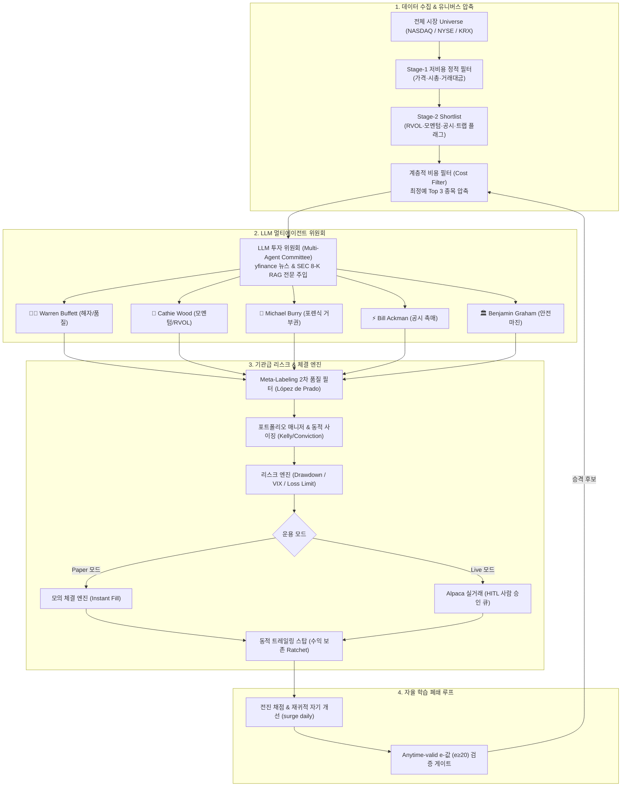

# surge_HTS — 자율형 멀티에이전트 퀀트 트레이딩 & 급등주 예측 아키텍처

> **"계좌가 살아남는 자율 퀀트 인프라 (Survival-First Autonomous Quant Infrastructure)"**  
> 전일 종가 대비 **+100% 급등 후보 포착** 및 **미국 레버리지 ETF 듀얼(Duel) 야간 단타 매매**를 수행하는 프로덕션급 퀀트 시스템입니다.  
> 단순 예측 모델에 의존하지 않고, **사후 복원이 불가능한 시점별 피처(Point-in-Time Snapshot)를 매일 영구 아카이빙**하며, **LLM 투자 위원회와 기관급 리스크 관리 엔진**을 통해 운용됩니다.

---

## 📑 목차 (Table of Contents)
1. [핵심 아키텍처 및 작동 원리](#1-핵심-아키텍처-및-작동-원리)
2. [전략별 핵심 매매 메커니즘](#2-전략별-핵심-매매-메커니즘)
3. [설치 및 환경 구축 가이드](#3-설치-및-환경-구축-가이드)
4. [전체 CLI 사용 매뉴얼](#4-전체-cli-사용-매뉴얼)
5. [모던 HTS 웹 대시보드 사용법](#5-모던-hts-웹-대시보드-사용법)
6. [무인 자동화 운영 파이프라인](#6-무인-자동화-운영-파이프라인)
7. [안전 장치 및 운영 규율](#7-안전-장치-및-운영-규율)

---

## 1. 핵심 아키텍처 및 작동 원리



### A. 2단계 깔때기 & 생존자 편향 완전 차단
* **기저율 0.1% 후보를 2~5%까지 압축**: 전체 유니버스에서 저가·소형·유동성 정적 필터로 후보를 압축한 뒤, 비싼 구조/옵션/SEC 공시 API는 최종 쇼트리스트에만 적용합니다.
* **Point-in-Time 아카이빙**: 상장폐지(Delisted) 종목을 절대 삭제하지 않고 보존하여 백테스트 왜곡 및 생존자 편향을 100% 원천 차단합니다.

### B. 진정한 LLM-Driven 투자 위원회 (Multi-Agent Committee)
* **전설적 투자자 5인 페르소나**:
  * **Warren Buffett**: 경제적 해자(Moat), 안정적 마진, 유상증자/독성부채 거부
  * **Cathie Wood**: 지수적 성장성, 폭발적 상대 거래량(RVOL), 유통주식수(Float) 탄력성
  * **Michael Burry**: 포렌식 리스크 검증, S-1/S-3 희석 폭탄, 펌프앤덤프 감지 및 **강력 거부권(Veto)**
  * **Bill Ackman**: 계약, FDA 승인, 실적 서프라이즈 등 핵심 행동주의 촉매(Catalyst) 추적
  * **Benjamin Graham**: 순유동자산 대비 청산가치 안전마진(Margin of Safety) 평가
* **컨텍스트 RAG 주입**: yfinance 실시간 뉴스 헤드라인과 SEC EDGAR 공시(8-K, 10-Q) 전문을 LLM에 주입하여 심층 추론(Reasoning)을 도출합니다.
* **계층적 비용 필터(Hierarchical Cost Filter)**: 매일 수십 개 후보 전체를 LLM으로 돌려 발생하는 API 비용 폭탄을 방지하기 위해, 기술적 스코어 상위 **Top 3 최정예 종목에 대해서만 LLM 위원회를 소집**합니다. (API 키 부재 시 규칙 기반 로직으로 Graceful Fallback)

### C. 기관급 체결 및 리스크 관리 엔진
* **Alpaca Live Broker 실거래 완전 통합**: Paper(모의) 거래는 즉시 체결되며, Live(실거래)는 **Human-In-The-Loop(HITL)** 원칙에 따라 웹 대시보드에서 사람이 명시적으로 승인(Approve)해야만 브로커로 실제 주문이 전송됩니다.
* **동적 트레일링 스탑 (Dynamic Trailing Stop)**: 수익 구간 진입 시 고점 대비 설정 비율 하락 지점으로 손절선(Stop Price)을 능동적으로 상향 갱신(Ratchet)하여 이익을 확정 짓습니다.
* **메타 라벨링 (Meta-Labeling) 2차 필터**: Marcos López de Prado의 금융 머신러닝 기법을 적용하여 1차 신호의 베팅 신뢰도를 재검증하고 승률을 극대화합니다.
* **기관급 퀀트 티어 시트 (Quant Tear Sheet)**: 연율화 수익률, Sharpe, Sortino, Calmar, CVaR 95%(Expected Shortfall), Omega Ratio, Max Drawdown을 실시간 산출합니다.
* **시세 3중 Failover**: yfinance → Finnhub API → Yahoo 직접 스크랩의 3단계 폴백 구조로 단일 장애점(SPOF)을 제거했습니다.

### D. 재귀적 자기 개선 엔진 (Recursive Self-Improvement)
* `surge daily` 루프를 통해 전일 예측 결과를 자동으로 채점(Scoring)합니다.
* Šidák 다중검정 보정이 적용된 가설 발굴기(`learn.py`)가 오류 원인(Culprit)과 신호 충돌을 분석하여 새로운 섀도 팩터와 가중치 변형을 전진 경쟁에 자동 투입합니다.
* **Anytime-valid e-값 (e≥20)** 검정으로 엿보기 편향(Optional-stopping bias) 없는 무결점 통계적 검증을 제공합니다.

---

## 2. 전략별 핵심 매매 메커니즘

### ① 점화(Ignition) 급등 스크리너 (`surge watchlist`)
* **목표**: 당일 장마감 시점에 "내일 +100% 폭등할 잠재력을 가진 초소형 저유동주"를 포착.
* **가점 요소**: 초소형 유통주식수(Float < 10M), 폭발적 상대 거래량(RVOL > 2.5x), 높은 공매도 잔고 비율, 연속 양봉 모멘텀, 리버스 스플릿 직후.
* **감점(트랩) 요소**: SEC S-1/S-3 유상증자 발행 임박, 다일 연속 폭등 후 피로 누적, 거래량 없는 억지 갭.

### ② 미국 레버리지 듀얼 매매 (`surge duel`)
* **대상 페어**: SOXL/SOXS (반도체), TQQQ/SQQQ (나스닥), TECL/TECS (기술주), LABU/LABD (바이오), TNA/TZA (소형주), FAS/FAZ (금융).
* **신호 생성 원리**: 미국 본장 개장 전, **아시아 반도체 대표주(TSMC, 삼성전자, SK하이닉스, 도쿄일렉트론)의 장중 등락**과 **NQ 야간 선물**, **VIX 지수**의 가중 투표로 방향 판정.
* **원칙**: 확신도가 낮으면 **'관망(STAND_ASIDE)'**을 출력하며, 무리한 오버나이트를 금지하고 당일 청산(EOD Close)을 원칙으로 합니다.

### ③ 한국 가치사슬 순환매 (`surge rotation`)
* **원리**: 이미 상한가로 직행한 테마 대장주(선두 노드)를 추격 매수하지 않고, 1~2거래일 뒤 자금이 이동할 **'후방 부품/소재/장비주(후방거리 1~2)'**를 선취매.
* **규율**: 후방거리 0인 종목은 이미 과열된 핫노드이므로 시스템이 매수를 원천 차단합니다.

---

## 3. 설치 및 환경 구축 가이드

### 요구 사항
* Python 3.12+
* [uv](https://github.com/astral-sh/uv) (Astral의 초고속 패키지 관리자)

```bash
# 1. 저장소 클론
git clone https://github.com/489156/surge_HTS.git
cd surge_HTS

# 2. uv 가상환경 구축 및 전 의존성 설치 (LLM & 한국장 모듈 포함)
uv sync --extra llm --extra kr
```

### 환경 설정 (`.env`)
프로젝트 루트 경로에 `.env` 파일을 구성합니다:

```ini
# 시스템 모드
ENVIRONMENT=production
TRADING_MODE=paper                  # paper(모의) 또는 live(실거래)
STARTING_CAPITAL=10000.0

# LLM 투자 위원회 (Claude 3.5 기반 심층 추론)
ANTHROPIC_API_KEY=your_anthropic_api_key
ANTHROPIC_MODEL=claude-3-5-haiku-20241022

# Alpaca 실거래 브로커 API
ALPACA_API_KEY=your_alpaca_key
ALPACA_SECRET_KEY=your_alpaca_secret
ALPACA_BASE_URL=https://paper-api.alpaca.markets   # 실계좌는 https://api.alpaca.markets

# 고가용성 시세 피드 (선택)
FINNHUB_API_KEY=your_finnhub_key

# 리스크 방어막 설정
ENABLE_TRAILING_STOPS=true
TRAILING_STOP_PCT=0.10             # 고점 대비 10% 하락 시 이익 실현
MAX_DAILY_LOSS_PCT=0.03            # 당일 3% 손실 시 신규 진입 즉각 차단
MAX_DRAWDOWN_PCT=0.10              # 누적 10% 드로다운 시 킬스위치 자동 발동
```

---

## 4. 전체 CLI 사용 매뉴얼

```bash
# ── 1. 데이터베이스 초기화 및 종목 마스터 적재 ──
uv run surge init                     # SQLite WAL 모드 DB 초기화
uv run surge universe                 # NASDAQ Trader 종목 마스터 적재 (무료)

# ── 2. 일일 스냅샷 & 급등주 발굴 ──
uv run surge snapshot --fast          # 당일 시세 및 구조적 피처 영구 아카이빙
uv run surge watchlist --why          # 오늘의 급등 후보 랭킹 및 자연어 근거 조회
uv run surge reversals --why          # 급등 후 익일 되돌림(페이드) 후보군

# ── 3. AI 자동매매 & 포트폴리오 관제 ──
uv run surge trade --top 8           # 매매 1사이클 가동 (평가→토론→리스크→체결)
uv run surge portfolio               # 포지션, 현금, 샤프지수, 드로다운 조회
uv run surge approvals               # 실거래(Live) 대기 주문 확인 및 수동 승인
uv run surge killswitch --reason "긴급" # 전량 청산 및 시스템 긴급 셧다운

# ── 4. 야간 레버리지 듀얼 (SOXL vs SOXS) ──
uv run surge duel                    # 오늘 밤 방향성 판정 및 브래킷 주문 신호
uv run surge duel-eval               # 듀얼 모델 누적 적중률 채점
uv run surge quotes --health         # 시세 공급자 3중화 Failover 상태 점검

# ── 5. 자율 학습 & 통계 검증 게이트 ──
uv run surge verdict                 # [필독] 전략별 실측 엣지 판정 (⭐/🟢/🟡/⛔)
uv run surge daily                   # 폐쇄 학습 루프 1회 가동 (채점→진화→판정→기록)
uv run surge factors                 # 신규 발굴된 섀도 팩터 순위표

# ── 6. HTS 모던 웹 대시보드 실행 ──
uv run surge dashboard               # 웹 터미널 가동 (http://127.0.0.1:8000)
```

---

## 5. 모던 HTS 웹 대시보드 사용법

`uv run surge dashboard` 실행 후 브라우저(`http://127.0.0.1:8000`)에 접속하면, 핀테크 수준의 직관적인 다크 테마 터미널이 열립니다.

```
┌────────────────────────────────────────────────────────────────────────┐
│ PRO  surge HTS                [mode · paper]  [kill switch · armed]  │
├────────────────────────────────────────────────────────────────────────┤
│ [🌐 전체 보기]   [⚡ 실전 매매 & 포트폴리오]   [🤖 AI 위원회]   [📊 통계 검증] │
├────────────────────────────────────────────────────────────────────────┤
│ 📢 오늘의 AI 종합 브리핑 룸 (Executive Summary)                        │
│ ┌──────────────┬──────────────┬──────────────┬───────────────────────┐ │
│ │ 시장 레짐    │ 오늘 핵심 픽 │ 포트폴리오   │ 통계 검증 상태        │ │
│ │ 🟢 Risk-On   │ SOXL 매수    │ $10,000      │ 🟡 가설 단계 (표본축적)│ │
│ └──────────────┴──────────────┴──────────────┴───────────────────────┘ │
└────────────────────────────────────────────────────────────────────────┘
```

### 주요 화면 및 기능 안내
1. **AI 종합 브리핑 룸 (Executive Summary)**: 긴 표를 읽을 필요 없이, 접속 즉시 시장 분위기, 오늘의 1순위 행동 지침, 계좌 안전 상태를 4대 카드로 파악합니다.
2. **섹션별 친절한 가이드 박스 (💡 이 섹션은 무엇인가요?)**: 모든 카드 상단에 비전문가 트레이더도 1초 만에 이해할 수 있는 2줄 해설과 베팅 팁을 제공합니다.
3. **AI 투자 위원회 5인 시각적 페르소나 카드**:
   * 결정 로그의 종목을 클릭하면, 워렌 버핏(해자)👨‍🦳, 캐시 우드(모멘텀)🚀, 마이클 버리(포렌식 거부권)🐻, 빌 애크먼(촉매)⚡, 벤자민 그레이엄(안전마진)🏛 5인의 상세 추론 근거가 담긴 시각적 말풍선 카드가 즉각 표출됩니다.
4. **Human-In-The-Loop 실거래 승인 센터**: AI가 실거래 주문을 생성하면 대시보드 승인 큐에 대기하며, 관리자가 `[✓ 실거래 승인]` 버튼을 클릭해야만 실제 Alpaca 브로커로 전송됩니다.
5. **동적 트레일링 스탑 게이지**: 보유 포지션 테이블에서 현재가와 손절선 사이의 안전마진이 시각적 게이지 바로 표시되어, 수익이 자동으로 굳어지는 과정을 실시간 확인할 수 있습니다.

---

## 6. 무인 자동화 운영 파이프라인

본 시스템은 PC 전원 및 인프라 상황에 맞춰 **클라우드와 로컬 이중화 자동화**를 지원합니다:

### A. GitHub Actions 클라우드 파이프라인 (24/365 무인 가동)
* `.github/workflows/daily-pipeline.yml`:
  * **평일 UTC 13:30 (미국 개장 전)**: 유니버스 스냅샷 아카이빙 및 야간 콜 생성
  * **평일 UTC 00:00 (미국 마감 후)**: 전일 예측 사후 채점, 자기 개선 루프(`surge daily`) 실행, 결과를 깃허브 리포지토리에 자동 커밋.
* `.github/workflows/ci.yml`: 모든 PR 및 커밋에 대해 377개 단위 테스트 및 Ruff Lint 무결성을 100% 자동 검증.

### B. Windows 작업 스케줄러 로컬 파이프라인 (PC 상시 가동용)
```powershell
# 스케줄러 등록 (관리자 권한 PowerShell)
powershell -ExecutionPolicy Bypass -File scripts\setup_scheduled_tasks.ps1

# 등록 상태 확인
Get-ScheduledTask -TaskName 'surge-*' | Select-Object TaskName,State
```
* **등록 루틴**:
  * `surge-daily-evening` (21:35 KST): 미국 6개 페어 야간 콜 생성
  * `surge-daily-morning` (07:13 KST): 전일자 채점, 갭 분석, 데일리 리포트
  * `surge-kr-eod` (16:05 KST): 한국장 마감 후 회전(Rotation) 후보 산출
  * `surge-self-improve` (07:55 KST): 재귀적 자기 개선 학습 루프

---

## 7. 안전 장치 및 운영 규율

> [!CAUTION]
> **투자 고지사항 (Disclaimer)**  
> 본 프로그램은 소프트웨어 도구 및 알고리즘 정보 제공을 목적으로 하며, 금융투자업 인가에 따른 투자자문 또는 자산운용 행위가 아닙니다. 모든 백테스트와 산출물은 과거 데이터에 기반한 통계적 가설입니다.

1. **검증 게이트 우선 원칙**: `surge verdict`에서 **⭐(신호)** 판정을 받기 전까지 모든 산출물은 '가설'에 불과하며, 실제 자금을 투입하지 않는 페이퍼 트레이딩으로만 시험해야 합니다.
2. **하드웨어 레벨 Kill-Switch**: 누적 손실 10% 초과 또는 긴급 상황 시 대시보드나 CLI의 `surge killswitch`로 0.1초 만에 전량 청산 및 시스템 정지가 가능합니다.
3. **무결점 재현성**: 모든 가격과 피처는 `snapshot_date`를 포함한 불변(Point-in-Time) 원장으로 기록되므로, 룩어헤드 편향이나 백테스트 거짓말이 불가능합니다.

---

## 8. 라이선스
MIT License. 상세 내용은 [LICENSE](LICENSE) 파일을 참조하십시오.
